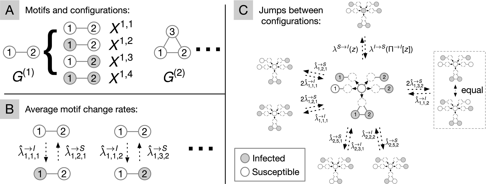

# Motif-based mean-field approximation of interacting particles on clustered networks

This repository is the official implementation of "Motif-based mean-field approximation of interacting particles on clustered networks", introducing the motif-based mean field (MMF) equations as a mean field methodology for jump dynamics on complex networks with arbitrary network motif configurations.



## Installation

To install requirements:

```shell script
pip install -r requirements.txt
```

If needed, set PYTHONPATH to include the top-level folder, e.g.
```shell script
export PYTHONPATH=$PYTHONPATH:$(pwd)
```

## Usage

The motif-based mean-field approximation can be found in mmf/approximations.py and can be used by calling MMF_from_distribution for a given set of motifs, hyperstub degree distribution, rate function and initial state distribution. For an example of how to use the mean field approximation, see one of the many examples in the experiments folder. 

## Experiments

The generated plots can be found in the figures folder. For detailed discussions of the results, see the paper.

To reproduce the plots of the paper, run the corresponding scripts in the experiments folder.
